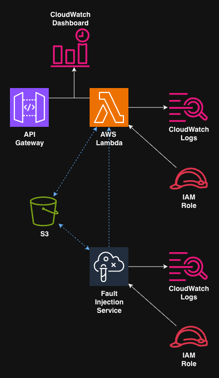
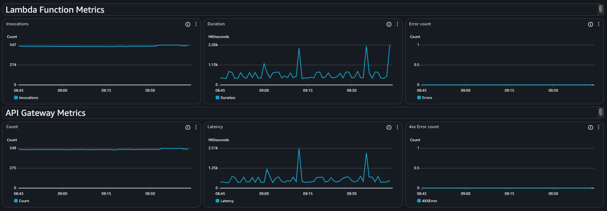
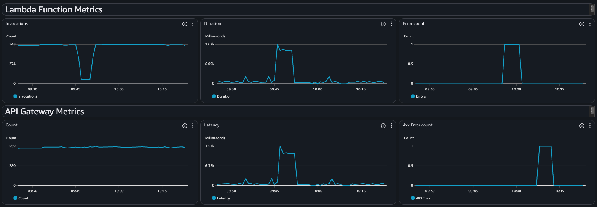

# cloudformation-aws-fis-lambda-monitoring
This repository contains an example configuration which can be used to demonstrate how to use Amazon's Fault Injection Service (FIS) to test monitoring in a serverless environment.

It deploys the following configuration via a CloudFormation SAM template:



* an example lambda, configured to use the FIS lambda layer,
* an API Gateway to access the lambda,
* an example CloudWatch dashboard,
* a FIS experiment template which you can run to test the lambda.

## Deploying the Configuration
The template is written using the AWS Serverless Application Model (SAM) which has the advantage that it handles the deployment of lambda code without the need for a separate packing pipeline.

You'll need to have the SAM CLI tools installed - this is well documented in the [SAM installation documents](https://docs.aws.amazon.com/serverless-application-model/latest/developerguide/install-sam-cli.html).

With the CLI tool installed, and a set of AWS Credentials configured for use, follow these steps:

```
$ git clone git@github.com:headforthecloud/cloudformation-aws-fis-lambda-monitoring.git

$ cd cloudformation-aws-fis-lambda-monitoring.git

$ sam build

$ sam deploy --guided --capabilities CAPABILITY_NAMED_IAM   # follow the prompts
```

Once the template deploys, and your resources are available, the template will also output the URL of the API Gateway created as shown below:
```
-------------------------------------------
Outputs                                                                                                                                          
-------------------------------------------
Key                 ApiGatewayURL                                                                                                                
Description         API Gateway endpoint URL                                                                                                     
Value               https://c23t4h9ae4.execute-api.eu-west-2.amazonaws.com/prod/demo                                                             
-------------------------------------------
```

This can be used to test the infrastructure has deployed correctly, either by opening the URL in a browser, or a tool like `curl`.

## Running the FIS experiment template
The deployment will have created a number of resources (visible in the `Resources` tab of the CloudFormation stack in the AWS Console). One of these resources is a FIS experiment template.

To access the template, click on the appropriate link in the CloudFormation stack resources or open FIS in the console; either by typing `FIS` in the console search bar, or navigating to `https://eu-west-2.console.aws.amazon.com/fis/home` (replace `eu-west-2` with your region). From here, select `Experiment templates`, and you should be able to see a template with the description `FIS Lambda monitoring experiment`.

Click on the link for the associated `Experiment template ID` and you can then execute the experiment by clicking on the `Start experiment` button.

## Example monitoring dashboard
The CloudFormation stack will also deploy an example CloudWatch dashboard, again visible in the `Resources` tab of the CloudFormation stack.

If you start accessing the API Gateway URL repeatedly, possibly by running this bash script:

``` bash
while :
do
    curl _insert_gateway_url_here &
    sleep 0.5
done
```

and then open the dashboard (titled `ExampleFISDashboard`), you should see something like:



Running the FIS experiment whilst accessing the API Gateway URL should mean the dashboard changes to something like:



showing anomolies associated with the 3 stages of the deployed experiment.


## Python Development Setup
If you're just wanting to deploy the code in this repository, this section doesn't matter but in case you're interested ...

This project uses [uv](https://docs.astral.sh/uv/) for Python package management and virtual environment handling.


### Prerequisites

Install uv if you haven't already:

```bash
# macOS with Homebrew
brew install uv

# macOS/Linux
curl -LsSf https://astral.sh/uv/install.sh | sh

# Or with pip
pip install uv
```

### Setting up the Development Environment

1. Create and activate a virtual environment with the project dependencies:

```bash
uv sync
```

This will:
- Create a virtual environment in `.venv/`
- Install all project dependencies and dev dependencies
- Lock the dependencies in `uv.lock`

2. Activate the virtual environment:

```bash
source .venv/bin/activate
```

Or use uv to run commands directly in the virtual environment without activation:

```bash
uv run <command>
```

### Running Tests

Run the test suite using pytest:

```bash
# With activated virtual environment
pytest

# Or directly with uv
uv run pytest

# Run with coverage
uv run pytest --cov=src

# Run with verbose output
uv run pytest -v
```

### Other Useful Commands

```bash
# Install new dependencies
uv add <package-name>

# Install dev dependencies
uv add --dev <package-name>

# Update dependencies
uv sync --upgrade

# Run the lambda function locally (if applicable)
uv run python src/lambda_function.py
```